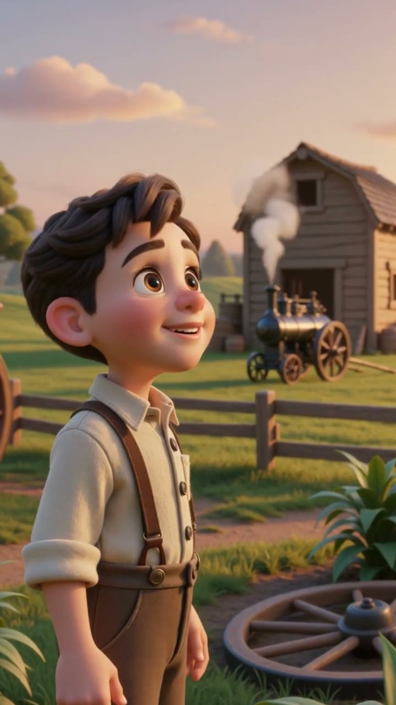

# Small Steps to Big Dreams

Animated short stories about inventors, artists, leaders, and dreamers, made for curious kids.

This repository contains the first finished episode, the launch plan, and the build-in-public assets for turning the experiment into a repeatable children's edutainment series.

## Episode 1: Henry Ford

**Public upload file:** [henry-ford-small-steps-marlene-720p.mp4](episodes/episode-01-henry-ford/henry-ford-small-steps-marlene-720p.mp4)

**Length:** 53.160 seconds  
**Format:** 9:16 vertical MP4  
**Narrator:** Marlene  
**Theme:** Big dreams start small. Mistakes can become lessons.

## What Is Included

- [Episode 1 video, captions, poster, and YouTube publish pack](episodes/episode-01-henry-ford/)
- [Launch execution pack](docs/launch_execution_pack.md)
- [Episode 1 distribution queue](docs/distribution_execution_queue.md)
- [Build-in-public short scripts](docs/build_in_public_scripts.md)
- [30-day content calendar](docs/30_day_calendar.csv)
- [Preview page](index.html)

## Series Positioning

Small Steps to Big Dreams is not a channel about "AI kids videos that make money."

It is a real children's edutainment IP made faster with AI: warm, original, parent-respectful, and built around repeatable moral arcs.

Each episode follows a simple pattern:

1. A curious beginning
2. A real doubt, mistake, or mess
3. One small repeated step
4. A breakthrough
5. A kid-facing question

Reusable close:

> Every big dream begins with one small step. What will you build?

## Launch Move

Upload the Marlene 720p file to YouTube Shorts with:

**Title:** Henry Ford's Big Dream Started Small #Shorts

Then publish the first build-in-public companion post within 24 hours:

> I made episode one of an AI-assisted kids show, but I am not trying to make AI slop.

## Notes

The finished public cut is in `episodes/episode-01-henry-ford/`. Earlier narrator tests and temporary generation assets are intentionally left out of this repo.
